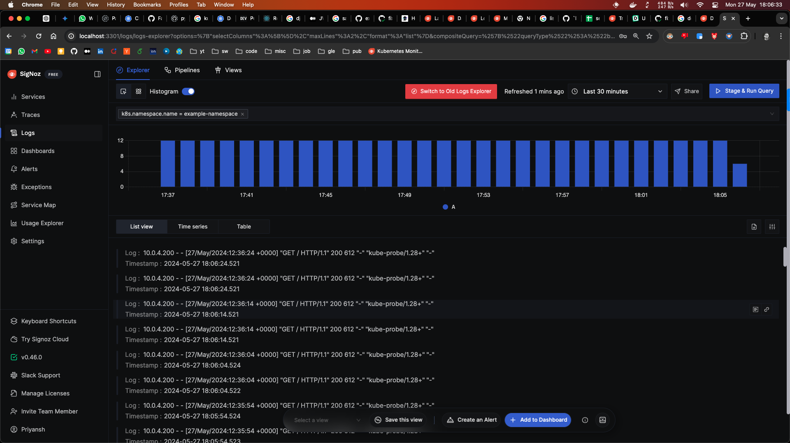
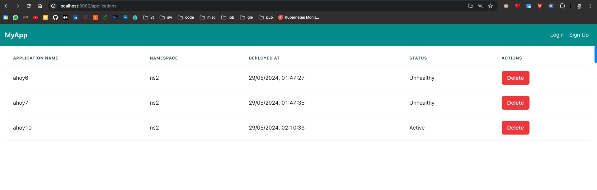

## Tech Spec
Database - Postgres
Logs APM - SigNoz (attached screenshot above)


## Commands to run

1. python manage.py makemigrations
2. python manage.py migrate
3. python manage.py runserver
4. start redis server - `redis-server`
5. start celery - `celery -A k8sapi worker`
6. Start frontend and backend
7. Hit the API mentioned below with dummy data
8. You'll see the details in the UI.


## Pod Logs in SigNoz and UI






## APIS

### GET

http://127.0.0.1:8000/deploy/deploy-list

http://127.0.0.1:8000/deploy/apps/1/logs/


### POST
http://127.0.0.1:8000/deploy/
```
{
    "namespace": "example-namespace2",
    "application_name": "ahoy",
    "chart_name": "hello-world",
    "chart_version": "1.0.2"
}
```

http://127.0.0.1:8000/authen/login/
```
{
        "email": "testuser@example.com",
        "password": "Password@123"
}
```

http://127.0.0.1:8000/authen/signup/
```
{
        "username": "testuser2",
        "email": "testuser2@example.com",
        "password": "Password@123"
}
```

### DELETE
http://127.0.0.1:8000/deploy/apps/<int:id>/

